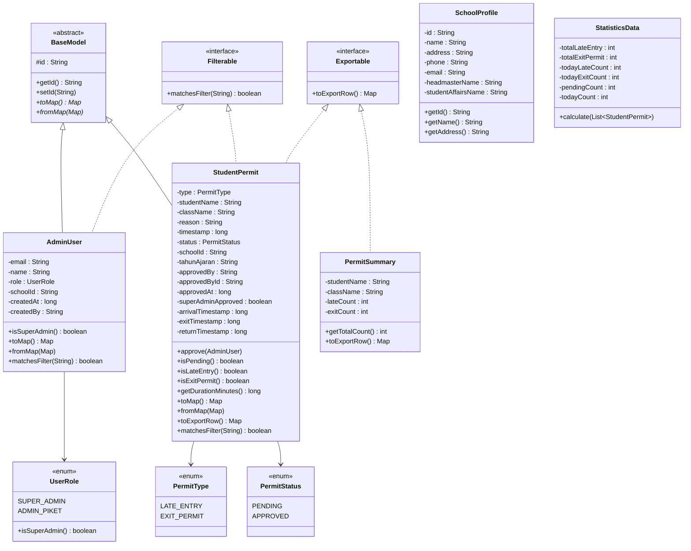
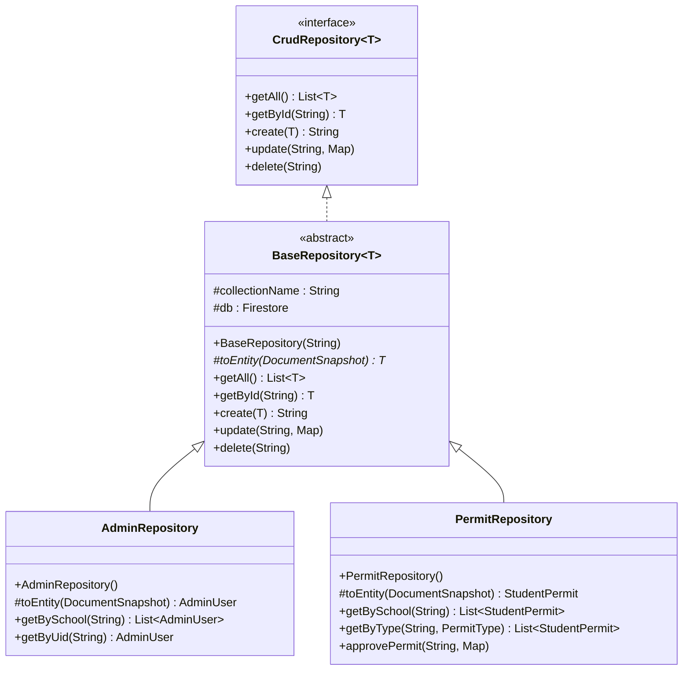
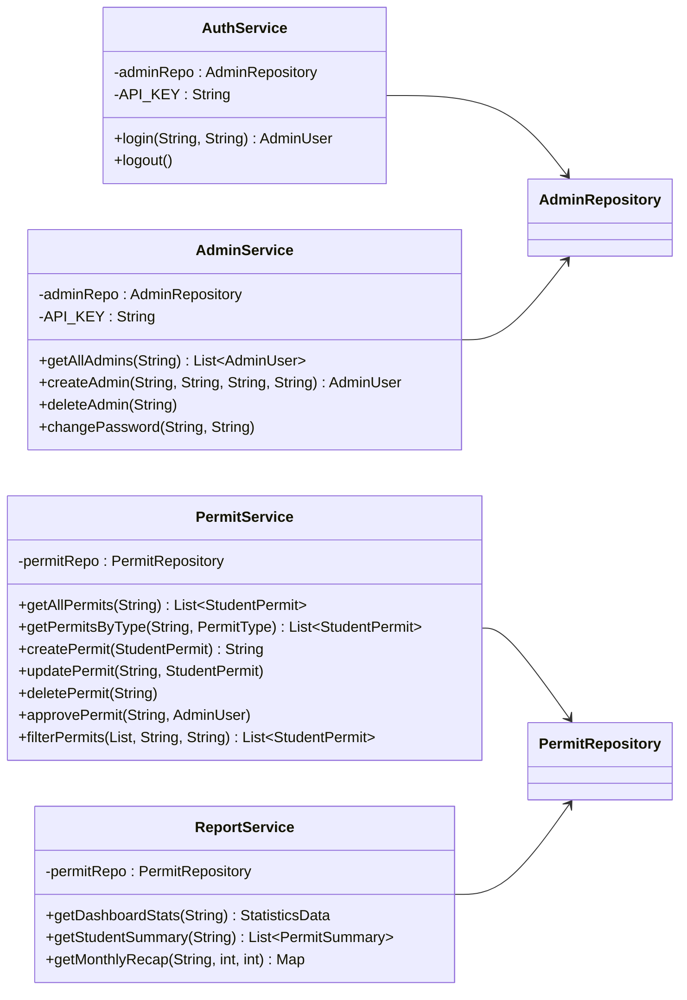
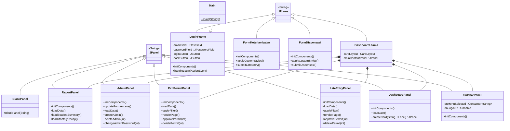
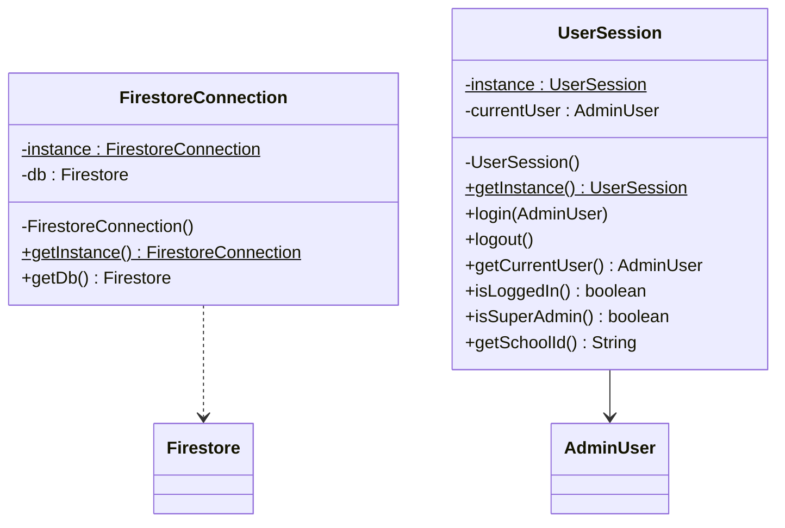

# 📘 Dokumentasi Proyek — SmartSchool Permit System (TubesPBO)

> **Aplikasi Java Desktop (Swing)** untuk manajemen surat izin siswa (terlambat masuk & izin keluar) di lingkungan sekolah menengah. Terhubung ke **Google Cloud Firestore** sebagai database.

---

## 📋 Daftar Isi

1. [Gambaran Umum Arsitektur](#-gambaran-umum-arsitektur)
2. [Class Diagram](#-class-diagram)
3. [Struktur Package](#-struktur-package)
4. [Detail Modul & Class](#-detail-modul--class)
   - [Modul 1: Application Core (`app`)](#modul-1-application-core-app)
   - [Modul 2: Data Model (`model` + `model.enums`)](#modul-2-data-model-model--modelenums)
   - [Modul 3: Data Access / Repository (`repository`)](#modul-3-data-access--repository-repository)
   - [Modul 4: Business Logic / Service (`service`)](#modul-4-business-logic--service-service)
   - [Modul 5: Utility (`util`)](#modul-5-utility-util)
   - [Modul 6: GUI — Login & Form Publik (`gui.login` + `gui.formDispen`)](#modul-6-gui--login--form-publik-guilogin--guiformdispen)
   - [Modul 7: GUI — Dashboard Admin (`gui.dashboard` + `gui.widget`)](#modul-7-gui--dashboard-admin-guidashboard--guiwidget)
5. [Konsep OOP yang Digunakan](#-konsep-oop-yang-digunakan)
6. [Pembagian Penanggung Jawab (Rekomendasi)](#-pembagian-penanggung-jawab-rekomendasi)

---

## 🏗 Gambaran Umum Arsitektur

Proyek ini mengikuti arsitektur **3-Layer (Layered Architecture)**:

```
┌────────────────────────────────────────────┐
│              GUI / Presentation            │ ← Swing JFrame & JPanel
│  (login, formDispen, dashboard, widget)    │
├────────────────────────────────────────────┤
│            Service / Business Logic        │ ← Logika bisnis & validasi
│      (AuthService, PermitService, dll)     │
├────────────────────────────────────────────┤
│         Repository / Data Access           │ ← CRUD ke Firestore
│    (BaseRepository, PermitRepository, dll) │
├────────────────────────────────────────────┤
│           Model / Domain Entity            │ ← POJO, Enum, Interface
│     (BaseModel, StudentPermit, dll)        │
├────────────────────────────────────────────┤
│            App / Infrastructure            │ ← Koneksi DB, Session
│     (FirestoreConnection, UserSession)     │
└────────────────────────────────────────────┘
```

---

## 📊 Class Diagram

### Diagram Utama — Model & Repository



### Diagram Repository Layer



### Diagram Service Layer



### Diagram GUI Layer



### Diagram Infrastruktur (Singleton)



---

## 📂 Struktur Package

```
com.smartschool.permit.tubespbo
├── TubesPBO.java                    ← Entry point awal (Hello World)
│
├── app/                             ← Infrastruktur & Konfigurasi
│   ├── FirestoreConnection.java     ← Singleton koneksi Firestore
│   ├── UserSession.java             ← Singleton session user login
│   ├── MainApp.java                 ← Test koneksi Firebase
│   └── TestCRUD.java                ← Integration test CRUD
│
├── model/                           ← Domain Entity / POJO
│   ├── BaseModel.java               ← Abstract base (id, toMap, fromMap)
│   ├── AdminUser.java               ← Model admin piket / super admin
│   ├── StudentPermit.java           ← Model surat izin siswa
│   ├── SchoolProfile.java           ← Profil sekolah (hardcoded)
│   ├── PermitSummary.java           ← Ringkasan izin per siswa
│   ├── StatisticsData.java          ← Data statistik dashboard
│   ├── Exportable.java              ← Interface untuk export data
│   ├── Filterable.java              ← Interface untuk filter/search
│   └── enums/
│       ├── PermitStatus.java        ← Enum: PENDING, APPROVED
│       ├── PermitType.java          ← Enum: LATE_ENTRY, EXIT_PERMIT
│       └── UserRole.java            ← Enum: SUPER_ADMIN, ADMIN_PIKET
│
├── repository/                      ← Data Access Layer (Firestore CRUD)
│   ├── CrudRepository.java          ← Interface generik CRUD
│   ├── BaseRepository.java          ← Abstract class implementasi CRUD
│   ├── AdminRepository.java         ← Repository koleksi "admins"
│   └── PermitRepository.java        ← Repository koleksi "permits"
│
├── service/                         ← Business Logic Layer
│   ├── AuthService.java             ← Login/Logout via Firebase Auth REST
│   ├── AdminService.java            ← CRUD admin + reset password
│   ├── PermitService.java           ← CRUD izin + approve + filter
│   └── ReportService.java           ← Statistik, summary, rekap bulanan
│
├── util/                            ← Helper / Utility
│   ├── DateUtils.java               ← Format tanggal/waktu (Asia/Jakarta)
│   ├── SchoolUtils.java             ← Tahun ajaran, daftar kelas
│   └── XlsxUtils.java              ← Export tabel Swing ke file .xlsx
│
└── gui/                             ← Presentation Layer (Swing)
    ├── login/
    │   ├── Main.java                ← Entry point utama aplikasi
    │   └── LoginFrame.java          ← Form login admin
    │
    ├── formDispen/
    │   ├── FormKeterlambatan.java    ← Form input siswa terlambat (publik)
    │   └── FormDispensasi.java      ← Form input izin keluar (publik)
    │
    ├── dashboard/
    │   ├── DashboardUtama.java      ← Frame utama dashboard (CardLayout)
    │   ├── DashboardPanel.java      ← Panel ringkasan & statistik
    │   ├── LateEntryPanel.java      ← Panel kelola siswa terlambat
    │   ├── ExitPermitPanel.java     ← Panel kelola izin keluar
    │   ├── ReportPanel.java         ← Panel laporan & rekap
    │   ├── AdminPanel.java          ← Panel kelola akun admin
    │   └── BlankPanel.java          ← Placeholder halaman belum jadi
    │
    └── widget/
        └── SidebarPanel.java        ← Komponen sidebar navigasi
```

---

## 📖 Detail Modul & Class

---

### Modul 1: Application Core (`app`)

**Fungsi:** Menyediakan infrastruktur dasar aplikasi — koneksi database dan manajemen session.

| # | Class | Tipe | Baris | Deskripsi |
|---|-------|------|-------|-----------|
| 1 | `FirestoreConnection` | Class (Singleton) | 58 | Mengelola koneksi tunggal ke Google Cloud Firestore menggunakan **Singleton Pattern**. Membaca `serviceAccountKey.json` dari resources, inisialisasi `FirebaseApp`, dan menyediakan instance `Firestore`. |
| 2 | `UserSession` | Class (Singleton) | 48 | Menyimpan state session user yang sedang login menggunakan **Singleton Pattern**. Menyediakan helper seperti `isLoggedIn()`, `isSuperAdmin()`, dan `getSchoolId()`. |
| 3 | `MainApp` | Class | 23 | Class sederhana untuk **test koneksi** ke Firebase secara standalone. |
| 4 | `TestCRUD` | Class | 90 | **Integration test** yang menguji alur lengkap: Create → Read → Approve → Delete pada data izin siswa via `PermitService`. |

**Design Pattern:** Singleton (pada `FirestoreConnection` dan `UserSession`)

---

### Modul 2: Data Model (`model` + `model.enums`)

**Fungsi:** Mendefinisikan struktur data (entity) yang merepresentasikan objek domain bisnis.

#### Class & Interface

| # | Class/Interface | Tipe | Baris | Deskripsi |
|---|-----------------|------|-------|-----------|
| 1 | `BaseModel` | **Abstract Class** | 27 | Base class untuk semua entity. Memiliki field `id` dan mendefinisikan method abstract `toMap()` dan `fromMap()` untuk konversi dari/ke Firestore document. |
| 2 | `AdminUser` | Class | 81 | Merepresentasikan akun admin (piket/super admin). Extends `BaseModel`, implements `Filterable`. Memiliki field: `email`, `name`, `role`, `schoolId`, `createdAt`, `createdBy`. Method `isSuperAdmin()` untuk cek role. |
| 3 | `StudentPermit` | Class | 178 | **Entity utama** — merepresentasikan surat izin siswa (terlambat/keluar). Extends `BaseModel`, implements `Filterable` dan `Exportable`. Memiliki 15+ field termasuk data approval dan timestamp. Method `approve()`, `isPending()`, `isLateEntry()`, `isExitPermit()`, `getDurationMinutes()`. |
| 4 | `SchoolProfile` | Class | 25 | Data profil sekolah yang di-hardcode (nama, alamat, email). Standalone, tidak extends `BaseModel`. |
| 5 | `PermitSummary` | Class | 42 | **DTO (Data Transfer Object)** untuk ringkasan izin per siswa. Implements `Exportable`. Berisi `lateCount`, `exitCount`, dan `getTotalCount()`. |
| 6 | `StatisticsData` | Class | 51 | **DTO** untuk data statistik dashboard. Method `calculate()` menerima list `StudentPermit` dan menghitung total, hari ini, dan pending. |
| 7 | `Exportable` | **Interface** | 14 | Kontrak untuk class yang bisa di-export ke Excel. Mendefinisikan `toExportRow()` yang mengembalikan `Map<String, Object>`. |
| 8 | `Filterable` | **Interface** | 14 | Kontrak untuk class yang bisa di-filter/search. Mendefinisikan `matchesFilter(String keyword)`. |

#### Enum

| # | Enum | Nilai | Deskripsi |
|---|------|-------|-----------|
| 1 | `PermitStatus` | `PENDING`, `APPROVED` | Status persetujuan surat izin. |
| 2 | `PermitType` | `LATE_ENTRY`, `EXIT_PERMIT` | Jenis surat izin: masuk terlambat atau izin keluar. |
| 3 | `UserRole` | `SUPER_ADMIN`, `ADMIN_PIKET` | Role pengguna. `SUPER_ADMIN` punya akses penuh; `ADMIN_PIKET` terbatas. Method `isSuperAdmin()`. |

**Konsep OOP:** Inheritance (`BaseModel`), Abstraction (abstract class + abstract method), Interface (`Exportable`, `Filterable`), Encapsulation (private fields + getter/setter), Polymorphism (`toMap()`/`fromMap()` di-override tiap subclass).

---

### Modul 3: Data Access / Repository (`repository`)

**Fungsi:** Menyediakan operasi CRUD ke Firestore. Memisahkan logika akses data dari business logic.

| # | Class/Interface | Tipe | Baris | Deskripsi |
|---|-----------------|------|-------|-----------|
| 1 | `CrudRepository<T>` | **Interface (Generic)** | 20 | Kontrak generik untuk operasi CRUD: `getAll()`, `getById()`, `create()`, `update()`, `delete()`. Menggunakan **Generics**. |
| 2 | `BaseRepository<T extends BaseModel>` | **Abstract Class (Generic)** | 80 | Implementasi umum dari `CrudRepository` yang bekerja langsung dengan Firestore. Menerima `collectionName` via constructor. Mendefinisikan abstract method `toEntity()` untuk konversi `DocumentSnapshot` → entity. |
| 3 | `AdminRepository` | Class | 49 | Extends `BaseRepository<AdminUser>`. Collection: `"admins"`. Method tambahan: `getBySchool(schoolId)` dan `getByUid(uid)`. |
| 4 | `PermitRepository` | Class | 70 | Extends `BaseRepository<StudentPermit>`. Collection: `"permits"`. Method tambahan: `getBySchool(schoolId)`, `getByType(schoolId, type)`, `approvePermit(permitId, approvalData)`. |

**Konsep OOP:** Generics (`<T extends BaseModel>`), Inheritance, Abstract class, Interface implementation, Polymorphism (method `toEntity()` di-override tiap subclass).

---

### Modul 4: Business Logic / Service (`service`)

**Fungsi:** Berisi logika bisnis, validasi, dan orkestrasi antar repository.

| # | Class | Baris | Deskripsi |
|---|-------|-------|-----------|
| 1 | `AuthService` | 78 | Menangani **login dan logout**. Login menggunakan Firebase Auth REST API (`signInWithPassword`). Setelah login berhasil, mengambil data admin dari `AdminRepository` dan menyimpan ke `UserSession`. Dependency: `AdminRepository` (via constructor injection). |
| 2 | `AdminService` | 104 | Mengelola akun admin: `getAllAdmins()`, `createAdmin()` (buat akun Firebase Auth + simpan ke Firestore), `deleteAdmin()`, `changePassword()` (via Firebase Admin SDK). Hanya Super Admin yang bisa akses. |
| 3 | `PermitService` | 87 | Logika bisnis surat izin: `createPermit()` (set timestamp, status PENDING, tahun ajaran otomatis), `approvePermit()` (set approved data), `filterPermits()` (filter berdasarkan kelas & search keyword), `updatePermit()`, `deletePermit()`. |
| 4 | `ReportService` | 84 | Logika laporan: `getDashboardStats()` (hitung statistik via `StatisticsData`), `getStudentSummary()` (ringkasan per siswa, sorted by total terbanyak), `getMonthlyRecap()` (rekap per kelas per bulan). |

**Konsep OOP:** Dependency Injection (repository diinject via constructor), Encapsulation (logika bisnis di-encapsulate di service, bukan di GUI/repository).

---

### Modul 5: Utility (`util`)

**Fungsi:** Helper class statik yang bisa dipakai di mana saja.

| # | Class | Baris | Deskripsi |
|---|-------|-------|-----------|
| 1 | `DateUtils` | 42 | Format tanggal/waktu menggunakan timezone `Asia/Jakarta` dan locale Indonesia. Method: `formatDate()` ("Senin, 01 Januari 2026"), `formatTime()` ("07:30"), `formatDateTime()` ("01 Jan 2026 07:30"), `isToday()`. Semua method **static**. |
| 2 | `SchoolUtils` | 53 | Logika terkait sekolah. `getTahunAjaran()` (otomatis ganti per Juli), `getGrades()` (X, XI, XII), `getAllClasses()` (generate X-A s.d XII-K), `parseClass()`. Semua method **static**. |
| 3 | `XlsxUtils` | 86 | Export data `JTable` ke file Excel (.xlsx) menggunakan **Apache POI**. Menampilkan `JFileChooser` untuk memilih lokasi simpan. Otomatis format header bold + auto-size kolom. Method **static**: `exportTable(JTable, String)`. |

---

### Modul 6: GUI — Login & Form Publik (`gui.login` + `gui.formDispen`)

**Fungsi:** Halaman-halaman yang diakses sebelum login (form publik) dan halaman login admin.

| # | Class | Extends | Baris | Deskripsi |
|---|-------|---------|-------|-----------|
| 1 | `Main` | — | 8 | **Entry point aplikasi**. Memanggil `LoginFrame.main()`. |
| 2 | `LoginFrame` | `JFrame` | 181 | Form login admin dengan field email & password. Validasi input sebelum kirim. Login dijalankan di **background thread** (`SwingWorker`) agar UI tidak freeze. Jika berhasil → buka `DashboardUtama`. Tombol "Kembali" → buka `FormKeterlambatan`. |
| 3 | `FormKeterlambatan` | `JFrame` | 372 | Form input **siswa terlambat masuk** (diisi oleh petugas piket/siswa langsung). Field: nama, kelas, alasan. Submit data ke Firestore via `PermitService` di background thread. Styling kustom diterapkan di `applyCustomStyles()`. |
| 4 | `FormDispensasi` | `JFrame` | 417 | Form input **izin keluar siswa** (dispensasi). Mirip `FormKeterlambatan` tapi untuk tipe `EXIT_PERMIT`. Menyertakan waktu keluar dan kembali. Styling kustom diterapkan di `applyCustomStyles()`. |

---

### Modul 7: GUI — Dashboard Admin (`gui.dashboard` + `gui.widget`)

**Fungsi:** Panel-panel halaman admin yang ditampilkan di dalam `DashboardUtama` menggunakan `CardLayout`.

| # | Class | Extends | Baris | Deskripsi |
|---|-------|---------|-------|-----------|
| 1 | `DashboardUtama` | `JFrame` | 65 | **Frame utama dashboard**. Menggunakan `BorderLayout` dengan `SidebarPanel` di kiri dan `CardLayout` untuk panel konten di tengah. Berisi semua panel (Dashboard, Siswa Terlambat, Izin Keluar, Laporan, Kelola Admin). Logout → kembali ke `LoginFrame`. |
| 2 | `SidebarPanel` | `JPanel` | 85 | **Komponen sidebar navigasi** yang reusable. Menampilkan nama sekolah, nama user, dan 5 menu navigasi + tombol Logout. Menggunakan **callback pattern** (`Consumer<String>` untuk navigasi, `Runnable` untuk logout). |
| 3 | `DashboardPanel` | `JPanel` | 151 | Panel **beranda/home**. Menampilkan 4 kartu statistik (Terlambat Hari Ini, Izin Keluar Hari Ini, Menunggu ACC, Total Riwayat) dan tabel 15 aktivitas terbaru. Data di-load via `ReportService` dan `PermitService` di background thread. |
| 4 | `LateEntryPanel` | `JPanel` | 285 | Panel kelola **siswa terlambat**. Fitur: tabel data, filter kelas (dropdown), search nama, **pagination** (25 per halaman), tombol Approve (setujui izin), tombol Delete (hapus), export XLSX. Semua operasi DB dijalankan di background thread. |
| 5 | `ExitPermitPanel` | `JPanel` | 284 | Panel kelola **izin keluar**. Struktur dan fitur mirip `LateEntryPanel` tapi untuk tipe `EXIT_PERMIT`. Fitur: tabel data, filter, search, pagination, approve, delete, export XLSX. |
| 6 | `ReportPanel` | `JPanel` | 189 | Panel **laporan & rekap**. Dibagi 2 bagian: (atas) Ringkasan per siswa — top 20 siswa dengan izin terbanyak, (bawah) Rekap bulanan per kelas — filter by tahun & bulan. Kedua tabel bisa di-export ke XLSX. |
| 7 | `AdminPanel` | `JPanel` | 307 | Panel **kelola akun admin**. Fitur: tabel admin, form tambah admin baru (email, password, nama), hapus admin, reset password. **Hanya Super Admin** yang bisa mengakses form tambah/hapus (cek via `UserSession.isSuperAdmin()`). |
| 8 | `BlankPanel` | `JPanel` | 18 | **Placeholder** untuk halaman yang belum diimplementasikan. Menampilkan pesan "Halaman X Belum Diimplementasikan". |

---

## 🎓 Konsep OOP yang Digunakan

| Konsep | Penerapan di Proyek |
|--------|-------------------|
| **Encapsulation** | Semua field di model dan service bersifat `private`, diakses via getter/setter. Logika bisnis di-encapsulate di layer service. |
| **Inheritance** | `AdminUser` & `StudentPermit` extends `BaseModel`. `AdminRepository` & `PermitRepository` extends `BaseRepository`. Semua GUI panel extends `JPanel` atau `JFrame`. |
| **Polymorphism** | Method `toMap()`, `fromMap()`, `toEntity()` di-override di tiap subclass. Method `matchesFilter()` diimplementasikan berbeda oleh `AdminUser` dan `StudentPermit`. |
| **Abstraction** | `BaseModel` (abstract class) dan `BaseRepository` (abstract class) menyembunyikan detail implementasi. |
| **Interface** | `CrudRepository<T>` (kontrak CRUD generik), `Exportable` (kontrak export), `Filterable` (kontrak filter). |
| **Generics** | `CrudRepository<T>`, `BaseRepository<T extends BaseModel>`. Memungkinkan repository digunakan untuk berbagai jenis entity. |
| **Singleton Pattern** | `FirestoreConnection` dan `UserSession` menggunakan Singleton thread-safe (`synchronized`). |
| **Dependency Injection** | Semua service menerima repository via constructor. Contoh: `PermitService(PermitRepository)`. |

---

## 👥 Pembagian Penanggung Jawab (Rekomendasi)

Rekomendasi pembagian tugas untuk tim 6 orang:

| PJ | Modul | File yang Ditangani | Scope Kerja |
|----|-------|---------------------|-------------|
| **PJ 1** | Application Core + Model | `app/*`, `model/BaseModel`, `model/enums/*` | Koneksi Firebase, Singleton, Abstract Base, Enum. Pondasi proyek. |
| **PJ 2** | Model Entity | `model/AdminUser`, `model/StudentPermit`, `model/SchoolProfile`, `model/PermitSummary`, `model/StatisticsData`, `model/Exportable`, `model/Filterable` | Semua entity, interface model, dan DTO. |
| **PJ 3** | Repository Layer | `repository/*` | Interface CRUD, BaseRepository, AdminRepository, PermitRepository. Semua akses data Firestore. |
| **PJ 4** | Service Layer | `service/*` + `util/*` | AuthService, AdminService, PermitService, ReportService, dan semua utility helper. |
| **PJ 5** | GUI — Login & Form Publik | `gui/login/*`, `gui/formDispen/*` | LoginFrame, FormKeterlambatan, FormDispensasi, Main entry point. |
| **PJ 6** | GUI — Dashboard Admin | `gui/dashboard/*`, `gui/widget/*` | DashboardUtama, SidebarPanel, DashboardPanel, LateEntryPanel, ExitPermitPanel, ReportPanel, AdminPanel, BlankPanel. |

> **Catatan:** PJ 6 memiliki file paling banyak (8 file, ~1400+ baris). Bisa dipecah lagi jika diperlukan: 1 orang handle `DashboardUtama` + `SidebarPanel` + `DashboardPanel` + `BlankPanel`, 1 orang handle `LateEntryPanel` + `ExitPermitPanel` + `ReportPanel` + `AdminPanel`.

---

## 📊 Ringkasan Statistik Proyek

| Metrik | Jumlah |
|--------|--------|
| Total File Java | **39** |
| Total Package | **8** (tidak termasuk root) |
| Total Class | **28** |
| Total Abstract Class | **2** (`BaseModel`, `BaseRepository`) |
| Total Interface | **3** (`CrudRepository`, `Exportable`, `Filterable`) |
| Total Enum | **3** (`PermitStatus`, `PermitType`, `UserRole`) |
| Total Entry Point (main) | **6** (`TubesPBO`, `Main`, `LoginFrame`, `DashboardUtama`, `MainApp`, `TestCRUD`) |
| Build Tool | Maven (`pom.xml`) |
| Database | Google Cloud Firestore |
| Auth | Firebase Authentication (REST API) |
| GUI Framework | Java Swing |
| Export Library | Apache POI (.xlsx) |
